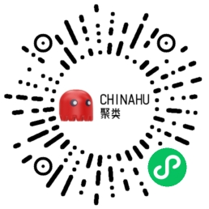
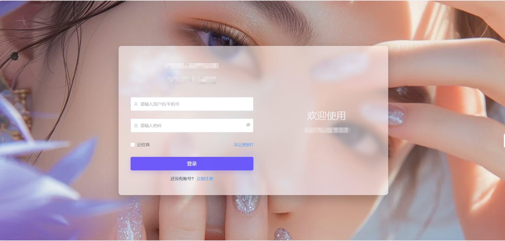
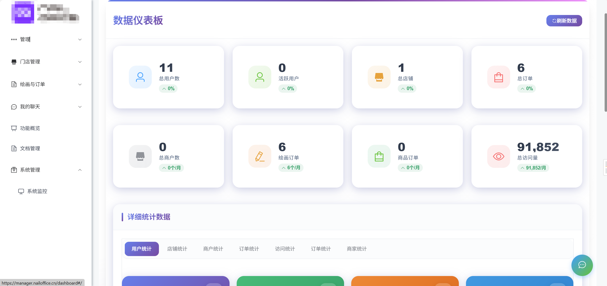
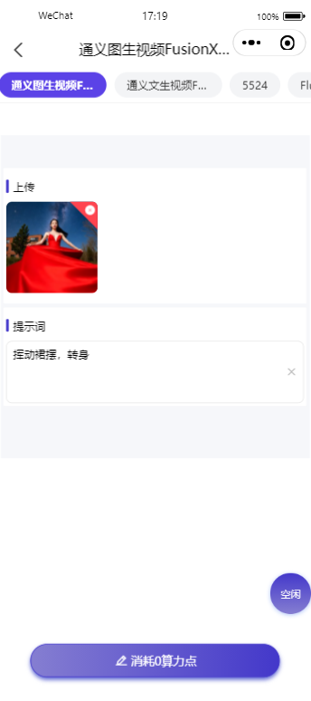
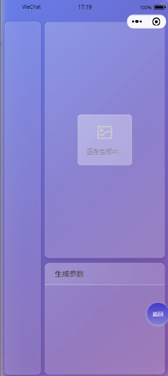
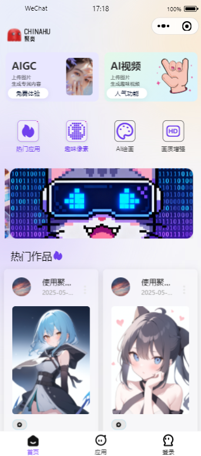
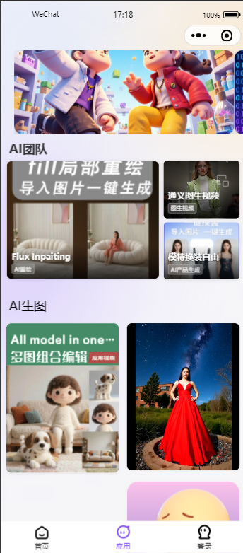

# EasyAI-uniapp 聚类开发版本 🚀.png>)

> 基于 [EasyAI 官方](https://doc.51easyai.com/) 开源项目深度优化的 AI 绘画小程序解决方案 | 支持 ComfyUI 工作流定制

## 🎉 全新升级说明
欢迎来小程序体验

### 后续开发计划
后续将开设新的付费版本：将开发与EasyAI后台兼容的独立后台，实现各种需求（如：商户入驻、代理入驻、抖音、小红书登录等一切想做的内容）并将集成小程序实现后端自定义小程序前端样式、下载小程序模板、小程序一键上传等功能。开源版本也会持续维护更新，只是更新速度不会那么快。

### 可持续发展计划
1. 前端小程序样式预留数据接口，可集成至后台中
2. 依托门店后台后续可开发小红书小程序、抖音小程序、H5、APP等多种类型的应用
3. 小程序可开发客服咨询以及定制订单发送、地址管理、物流管理等功能
4. 可集成ERP系统实现自动化订单提交

 

   

## 📌 项目特性

- ✅ **兼容性强**：适配EasyAI官方后台系统
- 💡 **功能亮点**：多模态作品展示（视频/音频/图文）、动态进度条交互
- ⚙️ **企业级支持**：提供微信客服集成、OSS 资源优化、管理后台扩展
- 🎨 **视觉升级**：重构 UI 界面、新增画廊视图、动画交互优化
- ❤️ **支持APP发布**：支持发布安卓APP，有需要的可以联系定制APP！

---

## 📞 联系方式

| 类型 | 联系方式 |
|------|----------|
| 微信咨询 | scxy_qhlc (备注：EasyAI 项目咨询) |
| 技术支持 | 有偿进行，费用明码标价68元/次每小时，没解决问题不收费 |

---

## 📄 安装指南

### 环境准备

| 工具 | 版本要求 | 获取地址 |
|------|----------|----------|
| 微信开发者工具 | 最新版 | [官网下载](https://developers.weixin.qq.com/miniprogram/dev/devtools/download.html) |
| HBuilderX/VsCode | 任选其一 | [官方地址](https://www.dcloud.io/hbuilderx.html) |
| npm环境 | 需要安装 | - |

### 部署步骤

#### 视频教程（抖音）

```bash
https://v.douyin.com/dJCnJcC-S-A/ 
复制此链接，打开Dou音搜索，直接观看视频！
```

#### 相关教程链接

- [HbuilderX发布小程序教程](https://blog.csdn.net/lhz_333/article/details/121749358)
- [2025最新｜微信小程序域名配置全攻略：从服务器到业务域名，避坑指南](https://blog.csdn.net/u012210662/article/details/149384843)

#### 1. 初始化项目

```bash
# 1. 拉取项目或者下载zip文件
git clone https://github.com/chinahu-woker/easyai2work.git

# 2. 解压文件进入项目目录
cd easyai2work

# 3. 安装依赖（如果npm报错可以使用pnpm，Windows建议使用pnpm,因为兼容性好）
pnpm i    # 小白用户或windows用户建议使用
npm i     # 可用
```

#### 2. 环境配置（修改 `.env` 文件）

```env
# 完成以上操作后，进入目录找到.env文件修改你的后端域名
# 在此之前你需要：
# 1) 在管理后台中配置好你小程序id和密钥（在微信公众平台中获取）
# 2) 如果使用域名请配置好反向代理，测试可以使用ip地址，但要记得注释
# 3) 确保以上配置无误后进入下一步
# 4) 小程序要上线必须有域名，记得注释多余的内容或者删掉注释

VITE_API_URL=https://你的域名或ip/api
VITE_WS_URL=wss://你的域名或ip/socket.io
```

#### 3. 编译运行

```bash
方式一：
# 本地调试，在当前项目目录下执行该命令
npm run dev:mp-weixin
# 命令运行完成后打开微信小程序开发者工具，导入项目：
# f:\MyGithub\myself-acgi-mpweixin\dist\dev\mp-weixin\

# 发布时使用此命令构建生产包
# 然后也是用微信小程序开发者工具导入项目->发布
pnpm build:mp-weixin
npm build:mp-weixin

方式二：
使用HbuilderX工具导入项目，顶部选择运行——>运行到微信小程序。如果是发布的话 选择发布——>微信小程序
在微信开发者工具打开运行后可以上传（具体操作请看我的[抖音视频教程](https://v.douyin.com/dJCnJcC-S-A/ )）
```

#### 4. 部署注意事项

- 执行npm命令时报错：删除 `node_modules` 后再次执行，若仍报错则删除 `node_modules` 后执行 `pnpm i`
- 运行开发者工具中没有显示：极大可能是env配置不对或者后台没有正确配置
- 微信小程序开发工具中能正常显示但预览或真机调试无显示：可能是SSL证书不被微信认可，需要配置阿里云、腾讯云等大厂的正规SSL证书（有免费试用）
- 感谢长期支持项目的用户，让项目能持续前进

---

## 📅 版本迭代记录

### v2025.12.21(兼容3.5.4)
**新增**
- 图标组件(NewIcon)支持自定义图标。具体参数见配置文件文档。
- 修改应用展示页面，使用分类组件展示
- 新增小程序跳转（不用可删）
- 新增列表分类组件
**修复**
- 修复顶部组件的标签匹配问题。
### v2025.11.27(兼容3.5.2)
**修复**
- 兼容最新版本后台社区API接口
### v2025.11.7(兼容3.5.0)
**优化**
- 优化包结构，使用小程序的分包的形式
### v2025.11.1(兼容3.4.9)
**修复**
- 修复遮罩组件，大家可以试一试反馈一下问题
- 优化了首页分享，现在首页分享可以更新热门作品封面作为分享图，只需要点击首页作品卡片的右上角有个小图标即可
- 对于应用存在大量视频的用户，目前还没有找到好的解决方案，建议用图片，视频太多低端机很卡。

### v2025.10.12(兼容3.4.7)
- **修复**：
- 修复遮罩组件
### v2025.10.11(兼容3.4.6)
- **优化**：
- 安卓设备自动降级为高性能纯色背景
- iOS设备保留精美的毛玻璃效果
- 无需JS检测，纯CSS实现
- **新增**
- 添加了通知组件
- 用户点击 → 显示缓存数据(50ms) → 显示骨架屏 → 异步加载最新数据 → 增量更新UI
- 添加缓存机制
- 异步数据加载
- 创建骨架屏组件
- 配置页面过渡动画
- 添加加载状态反馈

### v2025.10.3（兼容3.4.5）

#### 🆕 新增功能

- **分享功能**：支持社区内容分享到聊天和朋友圈，并且点击后直接跳转到该页面
- **配置文档**： 
    ```
    src\cofigs\data\pagesGlobalData_doc.md
    
    ```
- **优化**：
  1. 作品生成页面动态背景
  2. 修改导航栏样式，提升导航栏美观度

#### 🐛 修复问题

1. 优化前端渲染跳转方案，提升速度降低延迟，提高了用户体验
2. 修复多图上传组件的bug，完美适配后端组件数据
3. 优化了上下滚动的延迟卡顿问题

### v2025.9.21 (兼容3.4.4)


#### 🆕 新增功能

- **如何修改前端内容**：
  - 在src\cofigs\data\pagesGlobalData.json中可以修改logo、图标、标签等
  - 如何使用：采用标签识别的方式来区分内容，在EasyAI后台将对应应用设置为对应标签即可在前端对应显示

- **高级组件系列**：
  - 高级图片选择器组件（与网站功能一致的插件设计）
  - 高级标签选择器组件（与网站功能一致的插件设计）
  - 高级Slider选择组件（与网站功能一致的插件设计）
  - 自定义LoRA名称组件（与网站功能一致的插件设计）

- **应用管理优化**：
  - 顶部应用切换栏（支持在顶部直接切换应用页面，应用间数据不会因缓存问题被干扰）
  - 首页商户应用自动匹配组件（只需在EasyAI应用后台将应用名称或标签设置为对应值即可使用，生效后应用会出现紫色边框和红点，未生效则提示未开放）
  - 顶部应用跳转组件
  - 热门应用组件（只需在EasyAI应用后台将应用标签设置为"热门"即可使用，未生效则不显示）
  - 非组织应用不可见（对于有设置组织的应用，当前用户非本组织不可见）

- **界面与交互优化**：
  - 全新底部导航栏（重新设计底部导航栏功能与样式）
  - 生成结果展示（重写生成结果展示页面，使用缩略图+主图的形式展示，兼容多批次多图，同时兼容视频、文本显示）
  - 门店付费页面应用展示插件

#### 🐛 修复问题

- 修复高级图片选择器后端传值问题
- 修复高级标签选择器后端传值问题
- 修复微信小程序中账号密码登录的传值问题，同时兼容H5版本使用
- 修复因数据错误处理函数导致提交任务后进度显示问题
- 修改前端组件匹配机制，兼容后缀型插件名称
- 修复随机种子插件18位太长问题（压缩至与官网相同的12位）
- 修复支付功能的TypeScript问题
- 修正流处理代码以消除 TypeScript 报错
- 修复热门应用对视频兼容的问题，优化对展示数据较多的情况下实现10条每次的动态加载

### v2025.9.16 (兼容3.4.4)

- 优化前端显示细节
- 优化前端显示组件，解决切换标签时出现重复卡片的问题

### v2025.8.26 (兼容3.4.2)

- 新增视频上传插件（功能完整性待测试）

### v2025.8.24 (兼容3.4.2)

- 向官方大版本更新进行融合

### v2025.7.26 (兼容3.3.1)

- 完善遮罩绘制组件的绘制逻辑
- 现在只需一次上传就支持遮罩绘制，相比上个版本需要上传两次，用户体验更好
- 关于局部绘制的工作流作者已经放在文件中，用户可以自行查看
- 修复部分WebSocket的bug

### v2025.7.23 (兼容3.3.1)

- 修复上个版本残留的bug
- 新增遮罩绘制插件，支持涂抹、直线、方框绘制（测试版，有bug请及时反馈作者修复）

### v2025.7.10 (兼容3.2.7)

- 新增多图上传组件，一次支持上传6张
- 新增账号登录、注册功能，用户可以在小程序端使用微信登录或账号密码登录
- 优化历史页面的按钮以及返回按钮

### v2025.7.3 (兼容3.2.5)

- 删除AI聊天页面（因官方接口更改，需要时间兼容，临时推出该版本）
- 修改详情页面，现在直接跳转到绘画页面
- 修复创意页面的评论功能
- 创意页面的评论支持回复和删除，画同款支持带参跳转
- 更换会员充值接口的banner（因有人嫌太丑）
- 修复绘画历史页面的下载功能

### v2025.5.26 (兼容3.1.7)

**核心优化：**

- DragButton2 组件性能提升 60%
- 自定义悬浮按钮初始位置配置
- 进度展示系统重构
- 新增作品下载功能入口
- 评论系统增强，支持多层回复

### v2025.4.21 (兼容3.1.1)

**主要更新：**

- 修复历史作品删除逻辑
- 完善邀请码/分享功能兼容
- 音频上传组件标准化配置（需配合后台 *.mp3 格式默认值）
- 管理员权限体系优化

### v2025.2.24 (兼容3.0.2)

**视觉升级：**

- 新增画廊式历史记录展示
- 个人中心 UI 重构
- 包体积优化（<2MB）

### 更早版本

查看完整更新日志 ➤ [版本历史](./CHANGELOG.md)

---

## 🧰 开发者须知

### 项目结构

```
src/
├── components/      # 核心组件
├── composables/     # 业务逻辑封装
├── stores/          # Pinia 状态管理
├── types/           # TypeScript 类型定义
└── views/           # 页面组件
```

### 技术栈

- 框架：Vue3 + UniApp
- 状态管理：Pinia + Vue3 Composition API
- 构建工具：Vite + HBuilderX
- 样式：SCSS + Tailwind CSS

---

## ⚠️ 常见问题

### 域名配置

- 需在小程序后台配置所有域名白名单
- WebSocket 建议通过 Nginx 做协议转换

### 图片资源

❗ 请勿直接使用作者 OSS 链接（会产生高额费用）

```bash
# 静态资源本地存储路径
/static/
```

### 功能调试

工作流配置需遵循：

1. `audio_path` 字段需带 `.mp3` 后缀
2. 模型权限需设置为管理员或以上

---

## 📸 效果预览

<p align="center">
  
  
</p>
<p align="center">
  
</p>

---

## 💸 赞助支持

如果有特殊需求也可以联系作者定制。如果你觉得这个项目帮到你了，欢迎请作者喝杯咖啡！