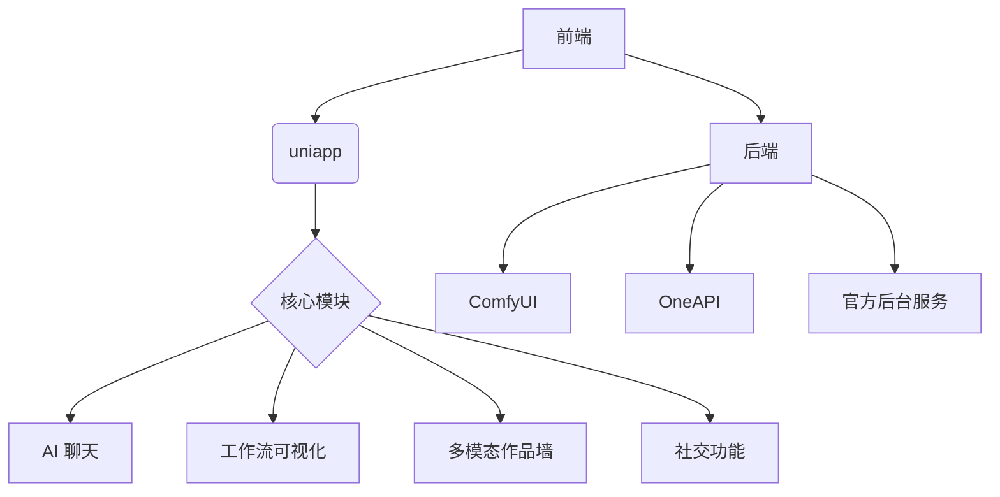

# EasyAI-uniapp 二次开发版本 🚀
> 基于EasyAI[官方地址](https://doc.51easyai.com/)官方开源项目深度优化的 AI 绘画小程序解决方案 | 支持 ComfyUI 工作流定制

---

## 📌 项目特性
- ✅ **兼容性强**：适配官方 3.1.7 版本后台系统
- 💡 **功能亮点**：AI 聊天对话、多模态作品展示（视频/音频/图文）、动态进度条交互
- ⚙️ **企业级支持**：提供微信客服集成、OSS 资源优化、管理后台扩展
- 🌐 **多云适配**：支持 OneAPI 多模型切换、WebSocket 反向代理配置
- 🎨 **视觉升级**：重构 UI 界面、新增画廊视图、动画交互优化

---

## 📞 联系方式
| 类型 | 联系方式 |
|------|----------|
| 微信咨询 | hdmlgzs (备注：EasyAI 项目咨询) |
| 技术支持 |  |

---

## 📦 系统架构

```mermaid
graph TD
    A[前端] --> B(uniapp)
    B --> C{核心模块}
    C --> D[AI 聊天]
    C --> E[工作流可视化]
    C --> F[多模态作品墙]
    C --> G[社交功能]
    A --> H[后端]
    H --> I[ComfyUI]
    H --> J[OneAPI]
    H --> K[官方后台服务]
```

---

## 📄 安装指南

### 环境准备
| 工具 | 版本要求 | 获取地址 |
|------|----------|----------|
| 微信开发者工具 | 最新版 | [官网下载](https://developers.weixin.qq.com/miniprogram/dev/devtools/download.html) |
| HBuilderX | 3.0.10+ | [官方地址](https://www.dcloud.io/hbuilderx.html) |

### 部署步骤
1. **初始化项目**
   ```bash
   git clone https://github.com/chinahu-woker/easyai2work.git
   cd easyai2work
   npm install
   ```

2. **环境配置**（修改 `.env` 文件）
   ```env
   VITE_API_URL=https://yourdomain.com/api
   VITE_CHAT_URL=https://your-oneapi.com
   ```

3. **编译运行**
   ```bash
   # 本地调试
   npm run dev
   
   # 构建生产包
   npm run build
   ```

4. **部署注意事项**
   - 需配置 HTTPS 服务
   - WebSocket 需配置 Nginx 反向代理：
   ```nginx
   location /websocket {
       proxy_pass http://backend_server;
       proxy_http_version 1.1;
       proxy_set_header Upgrade $http_upgrade;
       proxy_set_header Connection "upgrade";
   }
   ```

---

## 📅 版本迭代

### v2025.5.26 (3.1.7 兼容版)
**核心优化：**
- DragButton2 组件性能提升 60%
- 自定义悬浮按钮初始位置配置
- 进度展示系统重构
- 新增作品下载功能入口
- 评论系统增强支持多层回复

### v2025.4.21 (3.1.1 兼容)
**主要更新：**
- 修复历史作品删除逻辑
- 完善邀请码/分享功能兼容
- 音频上传组件标准化配置（需配合后台 *.mp3 格式默认值）
- 管理员权限体系优化

### v2025.2.24 (3.0.2 兼容)
**视觉升级：**
- 新增画廊式历史记录展示
- 个人中心 UI 重构
- 包体积优化（<2MB）

### 更早版本
查看完整更新日志 ➤ [版本历史](./CHANGELOG.md)

---

## 🧰 开发者须知

### 项目结构
```
src/
├── components/      # 核心组件
├── composables/     # 业务逻辑封装
├── stores/          # Pinia 状态管理
├── types/           # TypeScript 类型定义
└── views/           # 页面组件
```

### 技术栈
- 框架：Vue3 + UniApp
- 状态管理：Pinia + Vue3 Composition API
- 构建工具：Vite + HBuilderX
- 样式：SCSS + Tailwind CSS

---

## ⚠️ 常见问题

### 域名配置
- 需在小程序后台配置所有域名白名单
- WebSocket 建议通过 Nginx 做协议转换

### 图片资源
❗ 请勿直接使用作者 Oss 链接（会产生高额费用）
```bash
# 静态资源本地存储路径
/static/
```

### 功能调试
- 工作流配置需遵循：
  1. `audio_path` 字段需带 `.mp3` 后缀
  2. 模型权限需设置为管理员或以上

---

## 📸 效果预览


---

## 💸 赞助支持
如果你觉得这个项目帮到你了，欢迎请作者喝咖啡☕：

